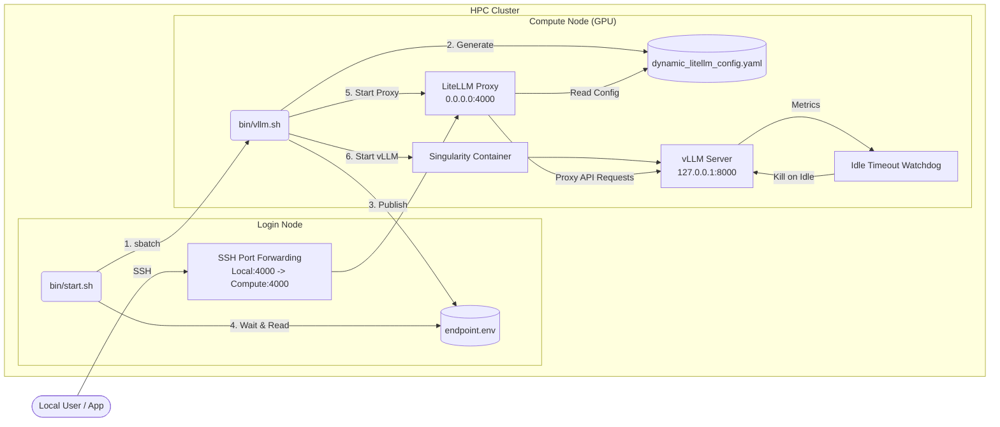
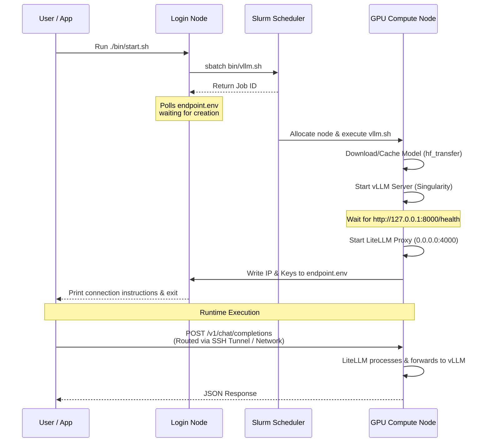

# Slurm LiteLLM vLLM

Welcome to the documentation for **Slurm LiteLLM vLLM**. This project provides a robust, automated way to start up large language models on an HPC Slurm cluster (such as UManitoba's Grex) using vLLM in a Singularity container, and exposing them efficiently via a LiteLLM proxy on the login node.

## Architecture

This project is built around two primary environments: the **Login Node** and the **Compute Node**.

### Startup Sequence

The diagram below illustrates the exact chronological sequence of events when a user starts the system:

### Components

1. **Start Script (`bin/start.sh`)**: The main entry point on the login node. It submits the slurm job and waits for the `endpoint.env` file to be populated by the compute node, ensuring you know exactly where to tunnel.
2. **vLLM Slurm Job (`bin/vllm.sh`)**: Executes on the compute node. It starts the vLLM server via Singularity, dynamically generates the LiteLLM config, launches the LiteLLM proxy in the background, and writes back the compute node's internal IP to `endpoint.env`.
3. **Idle Timeout Watchdog**: An integrated loop within the slurm script that monitors active connections to vLLM. If the server remains idle for 15 minutes, it terminates the process, relinquishing the GPU resources back to the Slurm scheduler.
4. **LiteLLM Proxy**: A lightweight proxy now bundled on the compute node. It maps the internal vLLM endpoint (`127.0.0.1:8000`) into a cluster-accessible standard OpenAI API interface (`0.0.0.0:4000`).

## Usage Guide
Refer to the repository's main `README.md` for quickstart setup instructions and connection testing.
