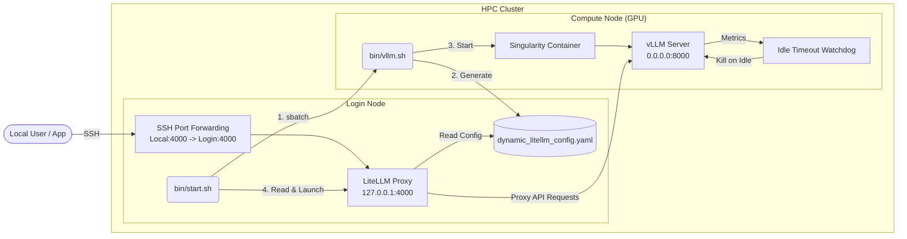

# Slurm LiteLLM vLLM

Welcome to the documentation for **Slurm LiteLLM vLLM**. This project provides a robust, automated way to start up large language models on an HPC Slurm cluster (such as UManitoba's Grex) using vLLM in a Singularity container, and exposing them efficiently via a LiteLLM proxy on the login node.

## Architecture

This project is built around two primary environments: the **Login Node** and the **Compute Node**.

### Components

1. **Start Script (`bin/start.sh`)**: The main entry point. It submits the slurm job, monitors the queue for initialization, and launches LiteLLM.
2. **vLLM Slurm Job (`bin/vllm.sh`)**: Executes on the compute node. It pulls the specified Hugging Face model from the cluster's parallel filesystem, starts the vLLM server via Singularity, and writes back the dynamically assigned compute node IP to a YAML configuration file.
3. **Idle Timeout Watchdog**: An integrated loop within the slurm script that monitors active connections to vLLM. If the server remains idle for 15 minutes, it terminates the process, relinquishing the GPU resources back to the Slurm scheduler.
4. **LiteLLM Proxy**: A lightweight server that maps the internal compute node's endpoint into a local `localhost:4000` port, standardizing the format to the OpenAI API specification.

## Usage Guide
Refer to the repository's main `README.md` for quickstart setup instructions and connection testing.
