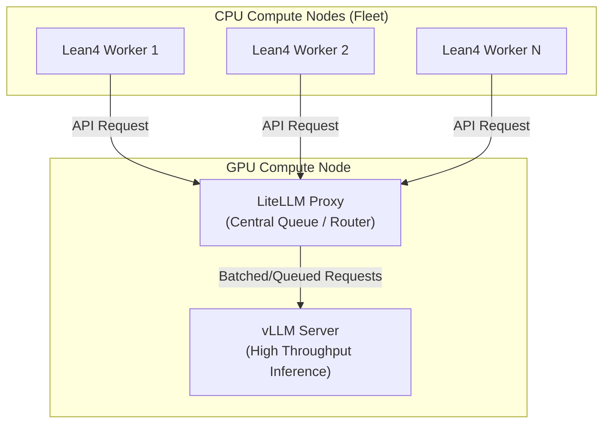
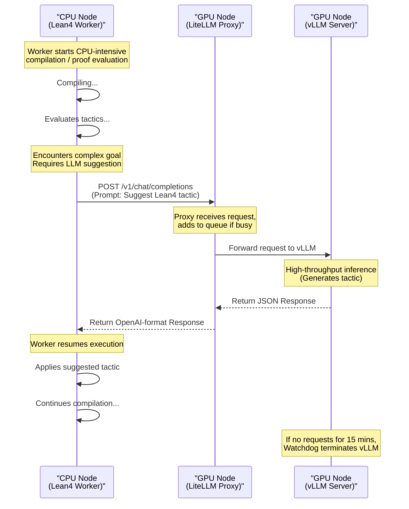

# Distributed Fleet Workflow (Lean4)

A powerful use case for this infrastructure is supporting a **fleet of parallel compute jobs** that do extensive local computation (e.g., formal verification, code compilation, theorem proving) but occasionally require LLM assistance. 

A primary example is running a massive array of **Lean4 workflows** where each worker mostly compiles code and evaluates proofs on standard CPUs, but periodically needs to query an LLM for proof step suggestions or code generation.

Rather than allocating expensive GPU resources to every single worker—which would be vastly underutilized during the lengthy compilation steps—you can use this setup to centralize the LLM on a single GPU node and route all worker requests to it through the LiteLLM proxy.

## Architecture



### Why use the LiteLLM Proxy in the middle?

While workers *could* technically connect directly to the vLLM IP, using the LiteLLM proxy on the login node provides critical benefits for a massive fleet of workers:
1. **Connection Pooling & Queuing**: If 1,000 workers query the LLM at the exact same millisecond, the proxy queues and manages the HTTP connections gracefully without overwhelming the vLLM server.
2. **Service Discovery**: The vLLM job grabs a dynamic internal IP on the cluster. By bundling the proxy on the same compute node and publishing an `endpoint.env` file, workers simply `source` the file and instantly know where to route traffic.
3. **Standardization**: It enforces the OpenAI API specification perfectly.

### Workflow Sequence

The following sequence diagram illustrates the lifecycle of one of these workers interacting with the centralized LLM during a typical proof search or compilation task:



---

## Setting up the Fleet Workflow

### 1. Launch the Centralized LLM
First, start the vLLM job and the proxy from the login node:
```bash
./bin/start.sh mistral
```
*Note: If your compute nodes cannot reach `127.0.0.1` on the login node, you may need to update `bin/start.sh` to bind LiteLLM to `0.0.0.0` or the login node's internal network IP (e.g., `--host 0.0.0.0`).*

### 2. Prepare the Worker Job Array
Create a Slurm job array script (e.g., `lean4_workers.sh`) that requests CPU-only resources. 

Point the workers to the login node where the LiteLLM proxy is running. Assuming your login node's internal hostname is `login1` and the proxy is on port `4000`:

```bash
#!/bin/bash
#SBATCH --job-name=lean4-fleet
#SBATCH --array=1-100        # Launch 100 parallel workers
#SBATCH --cpus-per-task=4    # CPUs for Lean4 compilation
#SBATCH --mem=8G             # Memory for Lean4
#SBATCH --time=02:00:00      # Job duration

# Source the dynamic endpoint published by the decentralized proxy
source run/endpoint.env

echo "Worker ${SLURM_ARRAY_TASK_ID} starting Lean4 compilation..."

# Run your Lean4 workflow
# (The workflow will automatically use the env variables when it needs LLM lookup)
python run_lean4_eval.py --task-id ${SLURM_ARRAY_TASK_ID}
```

### 3. Submit the Fleet
Submit your array of workers to the standard CPU queue:
```bash
sbatch lean4_workers.sh
```

As the 100 workers process their tasks, their infrequent LLM lookups will be routed through the LiteLLM proxy on the login node and processed efficiently by the single GPU node, ensuring maximum resource utilization and cost efficiency on the HPC cluster.
